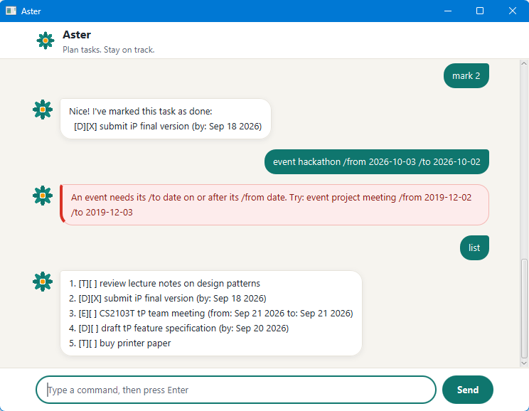

# Aster User Guide

Aster is a desktop chatbot for keeping track of your todos, deadlines and events.
You type short commands, Aster replies in a chat window, and your tasks are saved automatically.



- [Quick start](#quick-start)
- [Features](#features)
- [Saving your tasks](#saving-your-tasks)
- [FAQ](#faq)
- [Command summary](#command-summary)

## Quick start

1. Make sure Java 25 is installed. In a terminal, `java -version` should report version 25.
2. Download `Aster.jar` from the [latest release](https://github.com/MinhHoangLeNUS/ip/releases/latest).
3. Copy `Aster.jar` into an empty folder. Aster saves your tasks in this folder.
4. Open a terminal in that folder and run `java -jar Aster.jar`. The Aster window opens.
5. Type a command in the box at the bottom and press Enter or click **Send**. Try these:
   - `todo read chapter 6` adds a todo.
   - `list` shows your tasks.
   - `bye` closes Aster.

## Features

> **About the command formats**
>
> - Words in `UPPER_CASE` are for you to fill in. In `todo DESCRIPTION`, you could type `todo read chapter 6`.
> - Commands are lowercase and come first: `list` works, but `List` does not.
> - `/by`, `/from` and `/to` must each be a separate word and can appear only once in a command.
> - Dates are written as `yyyy-MM-dd`, for example `2026-09-18`, and must be real dates, so `2026-02-30` is refused.
>   Aster shows dates as `Sep 18 2026`.
> - `list`, `stats` and `bye` take nothing after them. `list all` is refused.

Each task is shown with two markers, for example `[D][X] submit iP final version (by: Sep 18 2026)`.
The first marker is the type: `T` for todo, `D` for deadline, `E` for event.
The second marker shows `X` when the task is done.

When Aster refuses an invalid command, it explains why in a red reply, and your list stays exactly as it was.

### Adding a todo: `todo`

Adds a task without a date.

Format: `todo DESCRIPTION`

Example: `todo read chapter 6`

```
Got it. I've added this task:
  [T][ ] read chapter 6
Now you have 1 task in the list.
```

The last line shows how many tasks you now have.

### Adding a deadline: `deadline`

Adds a task that is due by a date.

Format: `deadline DESCRIPTION /by DATE`

Example: `deadline submit iP final version /by 2026-09-18`

```
Got it. I've added this task:
  [D][ ] submit iP final version (by: Sep 18 2026)
Now you have 2 tasks in the list.
```

### Adding an event: `event`

Adds a task that runs from a start date to an end date.

Format: `event DESCRIPTION /from START_DATE /to END_DATE`

- `/from` must come before `/to`.
- The end date must be on or after the start date. A one-day event uses the same date twice.

Example: `event CS2103T team meeting /from 2026-09-21 /to 2026-09-21`

```
Got it. I've added this task:
  [E][ ] CS2103T team meeting (from: Sep 21 2026 to: Sep 21 2026)
Now you have 3 tasks in the list.
```

If the end date is before the start date, for example `event hackathon /from 2026-10-03 /to 2026-10-02`,
Aster does not add the event:

```
An event needs its /to date on or after its /from date. Try: event project meeting /from 2019-12-02 /to 2019-12-03
```

### Listing all tasks: `list`

Shows every task with its number.

Format: `list`

```
1. [T][ ] read chapter 6
2. [D][ ] submit iP final version (by: Sep 18 2026)
3. [E][ ] CS2103T team meeting (from: Sep 21 2026 to: Sep 21 2026)
```

If you have no tasks, Aster replies `Your list is empty.`

### Finding tasks: `find`

Shows the tasks whose description contains a keyword.

Format: `find KEYWORD`

- The search ignores capital letters and can match part of a word, so `find MEET` finds `CS2103T team meeting`.
- Only descriptions are searched, not dates.
- A keyword may contain spaces, and is matched as a whole phrase.

Example: `find team`

```
Here are the matching tasks in your list:
1. [E][ ] CS2103T team meeting (from: Sep 21 2026 to: Sep 21 2026)
```

If nothing matches, Aster replies `No tasks match that keyword.`

> **Note:** the numbers in search results count the matches only. Use `list` to find a task's number before using
> `mark`, `unmark` or `delete`.

### Marking a task as done: `mark`

Format: `mark TASK_NUMBER`

Example: `mark 2`

```
Nice! I've marked this task as done:
  [D][X] submit iP final version (by: Sep 18 2026)
```

If the task is already done, Aster tells you so and changes nothing:

```
This task is already marked as done:
  [D][X] submit iP final version (by: Sep 18 2026)
```

### Marking a task as not done: `unmark`

Format: `unmark TASK_NUMBER`

Example: `unmark 2`

```
Alright, I've marked this task as not done yet:
  [D][ ] submit iP final version (by: Sep 18 2026)
```

If the task is already not done, Aster tells you so and changes nothing:

```
This task is already marked as not done:
  [D][ ] submit iP final version (by: Sep 18 2026)
```

### Deleting a task: `delete`

Format: `delete TASK_NUMBER`

Example: `delete 1`

```
Noted. I've removed this task:
  [T][ ] read chapter 6
Now you have 2 tasks in the list.
```

The tasks after the deleted one move up by one number.

### Task numbers

`mark`, `unmark` and `delete` take the number that `list` shows.

- Use digits only. `2` and `02` both mean task 2.
  Signs, decimals and extra words are not task numbers:

  ```
  "+2" is not a task number. Try: mark 2
  ```

- The number must be from 1 to the number of tasks you have. Anything else, however large, is out of range:

  ```
  You have 3 tasks, so 9 is out of range. Pick a number from 1 to 3.
  ```

- If your list is empty, Aster says so first, for example `Your list is empty, so there is nothing to mark yet.`

### Viewing statistics: `stats`

Shows how many tasks you have, how many of them are done, and how many there are of each type.
It only reads your list, so nothing is changed or saved.

Format: `stats`

Example: with five tasks (two todos, two deadlines and one event), two of them done, Aster replies:

```
Here are your task statistics:
Total: 5 tasks
Completed: 2 (40%)
Not completed: 3
Todos: 2, Deadlines: 2, Events: 1
```

The completion percentage is rounded down, so 100% appears only when every task is done.
If you have no tasks, Aster replies `You have no tasks yet, so there are no statistics to show.`

### Exiting Aster: `bye`

Format: `bye`

Aster replies `Goodbye for now. Take care!` and closes the window a moment later.

## Saving your tasks

- Aster saves your list automatically after every change: adding, deleting, marking or unmarking a task.
  `list`, `find` and `stats` never change anything.
- Your tasks are kept in `data/aster.txt`, inside the folder you started Aster from.
  The file is created the first time you add a task, and your tasks are loaded again the next time you start Aster.
- If Aster cannot read the file, for example after it was edited by hand, Aster shows a red message.
  On Windows it reads:
  `I couldn't read your saved tasks from data\aster.txt, so I've stopped without changing anything. Please check or move that file, then start me again.`
  The path is written with your operating system's separator, so on macOS and Linux it appears as `data/aster.txt`.
  The file is left untouched and you cannot type commands. Fix or move the file, then start Aster again.
- If Aster cannot save, for example because something else is in the way of the `data` folder, your change
  still applies until you close Aster, and the reply ends with
  `I couldn't save your tasks. Your latest changes may not be available next time.`

## FAQ

**How do I move my tasks to another computer?**
Copy the `data` folder into the folder where you keep `Aster.jar` on the other computer.

**Can I use Aster in a terminal instead of a window?**
Yes. Run `java -cp Aster.jar aster.Aster` in the folder with `Aster.jar`.
The same command formats are available, but the terminal has no visual styling, and `list` produces no output
when the task list is empty.

## Command summary

| Action | Format | Example |
|---|---|---|
| Add a todo | `todo DESCRIPTION` | `todo read chapter 6` |
| Add a deadline | `deadline DESCRIPTION /by DATE` | `deadline submit iP final version /by 2026-09-18` |
| Add an event | `event DESCRIPTION /from START_DATE /to END_DATE` | `event CS2103T team meeting /from 2026-09-21 /to 2026-09-21` |
| List tasks | `list` | `list` |
| Find tasks | `find KEYWORD` | `find team` |
| Show statistics | `stats` | `stats` |
| Mark as done | `mark TASK_NUMBER` | `mark 2` |
| Mark as not done | `unmark TASK_NUMBER` | `unmark 2` |
| Delete a task | `delete TASK_NUMBER` | `delete 1` |
| Exit | `bye` | `bye` |
